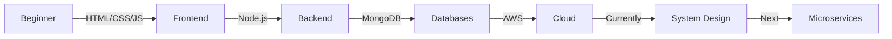

<div align="center">

# Welcome to My Digital Workspace


<p>
  
  
  
</p>

```ascii
╔═══════════════════════════════════════════════════════════╗
║  Turning Coffee into Code | Building Digital Solutions   ║
╚═══════════════════════════════════════════════════════════╝
```

[](https://www.linkedin.com/in/aman-kumar-682177255)
[](mailto:amandsvv4006@gmail.com)
[](https://github.com/amandsvv)
[](#)

</div>

---

## Quick Snapshot

<table>
<tr>
<td width="50%">

### About Me

```javascript
const aman = {
    role: "Full Stack Developer",
    education: "CS @ KR Mangalam University",
    focus: ["Backend", "System Design", "APIs"],
    currentlyLearning: ["AWS", "MongoDB", "Scalability"],
    funFact: "I debug with console.log()",
    lifePhilosophy: "Code. Build. Repeat."
};
```

</td>
<td width="50%">

### Current Focus

- System Architecture mastery
- Auth Systems (JWT, OAuth)
- Cloud Deployment on AWS
- Database Optimization
- API Performance Tuning

</td>
</tr>
</table>

---

## Tech Arsenal

<div align="center">

### Frontend Magic


### Backend Power


### Database & Storage


### Tools & Platforms


</div>

</td>
<td width="50%">

<h3 align="center">Task Handler</h3>

<div align="center">


</div>

<br>

**Purpose**: Complete project & task management solution

**Key Features**:
- Full CRUD operations
- Intuitive drag-drop interface
- Progress tracking & analytics
- Project categorization

**Built With**:  
`Node.js` • `Express` • `MongoDB` • `Bootstrap`

<div align="center">

[](https://github.com/amandsvv/task-handler)
[](https://github.com/amandsvv/task-handler)

</div>

---

## GitHub Analytics

<div align="center">


</div>

<div align="center">

### GitHub Trophies


</div>

---

## Contribution Timeline

<div align="center">


</div>

---

## Philosophy & Values

<div align="center">

| **Core Values** | **Approach** | **Strengths** |
|:-----------------:|:---------------:|:----------------:|
| Clean Code | Agile Development | Problem Solving |
| User Experience | Continuous Learning | Team Collaboration |
| Innovation | Best Practices | Quick Adaptation |
| Scalability | Documentation | Communication |

</div>

---

## What I Bring to the Table

<details>
<summary><b>Click to Expand My Superpowers</b></summary>

<br>

- **Backend Architecture**: Designing scalable, maintainable systems
- **API Development**: RESTful APIs with optimal performance
- **Database Design**: Efficient schemas and query optimization
- **Security First**: Implementing robust auth & authorization
- **Cloud Deployment**: AWS EC2, S3, and more
- **Problem Solving**: Algorithmic thinking and debugging
- **Team Player**: Collaborative mindset with great communication

</details>

---

## Learning Journey



---

## Let's Connect & Collaborate

<div align="center">

### Open to Opportunities

<table>
<tr>
<td align="center" width="33%">

### Projects
Excited about interesting  
collaborative projects

</td>
<td align="center" width="33%">

### Opportunities
Open to internships &  
full-time positions

</td>
<td align="center" width="33%">

### Mentorship
Happy to help fellow  
developers grow

</td>
</tr>
</table>

<br>

[](https://www.linkedin.com/in/aman-kumar-682177255)
[](mailto:amandsvv4006@gmail.com)
[](https://github.com/amandsvv)
[](#)

<br>

### Response Time: Usually within 24 hours

</div>

---

<div align="center">

## Random Dev Quote


---

### Profile Insights


---


**"Building the future, one commit at a time"**

<sub>Made with dedication and lots of coffee</sub>

</div>
